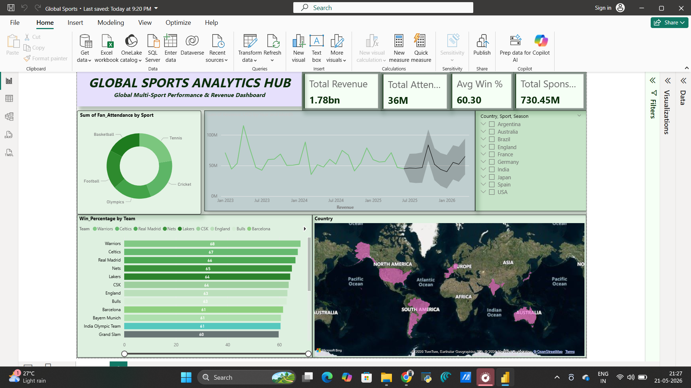

# global-sports-analytics-dashboard
Interactive Power BI dashboard analyzing global sports performance, revenue, fan engagement, and forecasting.
# 🌍 Global Sports Analytics Dashboard

## 📌 Project Overview
This Power BI dashboard analyzes:
- Football
- Cricket
- Basketball
- Tennis
- Olympics

It provides insights into:
- Revenue trends
- Fan attendance
- Team performance
- Country dominance
- Forecasting analytics

---

## 🛠 Tools Used
- Power BI
- DAX
- Excel

---

## 📊 Features
- KPI Cards
- Forecasting
- Global Sports Map
- Team Performance Analysis
- Revenue Analytics
- Interactive Slicers

---

## 📷 Dashboard Preview

---

## 🚀 Author
Jagannath
